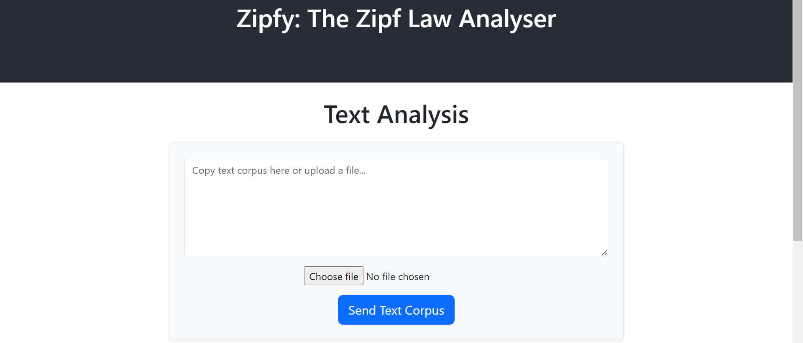
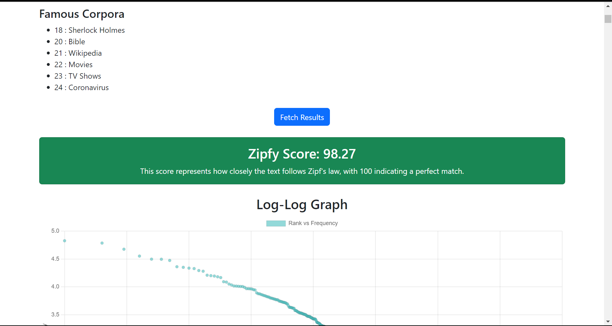

# ZIPFY: The Zipf Law Analyser

## Introduction
Welcome to Zipfy: The Zipf's Law Analysis Tool!

This application analyzes the frequency of words in a given text corpus and calculates how closely the text follows Zipf's Law. The project is designed to be user-friendly and provides insightful analysis results, including a Zipfian score, log-log graph, and other relevant statistics.

## Tech Stack
- **Backend**: Python | Flask
- **Frontend**: HTML | CSS | JS | React
- **Database**: SQLITE3
- **Containerization**: Docker

## Sneak Peek





## Installation
To simplify the setup and ensure a consistent development environment, this project uses Docker. Follow these steps to get started:

### Prerequisites
- **Docker**: Make sure Docker is installed on your machine. You can download Docker Desktop from [here](https://www.docker.com/products/docker-desktop) for Windows or Mac, or follow the [installation instructions](https://docs.docker.com/engine/install/) for Linux.

### Setup

1. **Clone the Repository**

   First, clone this repository to your local machine:

   ```sh
   git clone https://github.com/sumedhsingh/zipfy.git
   cd zipfy
   ```

2. **Build and Run Containers**
    
    Use Docker Compose to build and run the containers:
 
    ```sh
    docker-compose up --build
    ```
    This command will:

    - Build the Docker images for the frontend and backend services.
    
    - Start the containers based on the built images.
    
3. **Access the Application**

- **Frontend**: Open your web browser and navigate to http://localhost:80. 
- **Backend**: In case you want to work with the endpoints you can access them at http://localhost:5000 and refer to app.py.


4. **Stopping the containers**

    A simple way to stop the containers is ```ctr+c``` and for removing the container you can execute the following command:


    ```sh
    docker-compose down
    ```

    
PRs for fixing bugs and additional features to the repository are welcome!